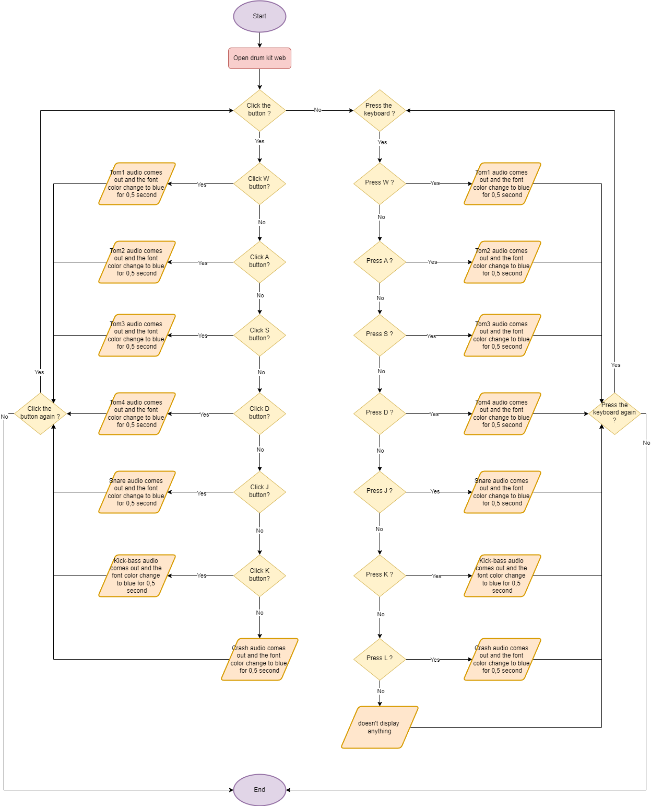

# Drum Kit Website 

    

This website lets users play drum sounds by either clicking buttons on the screen or pressing specific keys on the keyboard. It gives users a simple way to interact with both visuals and sounds, creating a real-time drumming experience. This feature can be used for fun, learning music, or as a creative tool for anyone interested in playing percussion instruments.

## Flowchart

## How to use

- Pressing the W key will play the tom 1 sound.
- Pressing the A key will play the tom 2 sound.
- Pressing the S key will play the tom 3 sound.
- Pressing the D key will play the tom 4 sound.
- Pressing the J key will play the snare sound.
- Pressing the k key will play the kick bass sound.
- Pressing the L key will play the crash sound.

